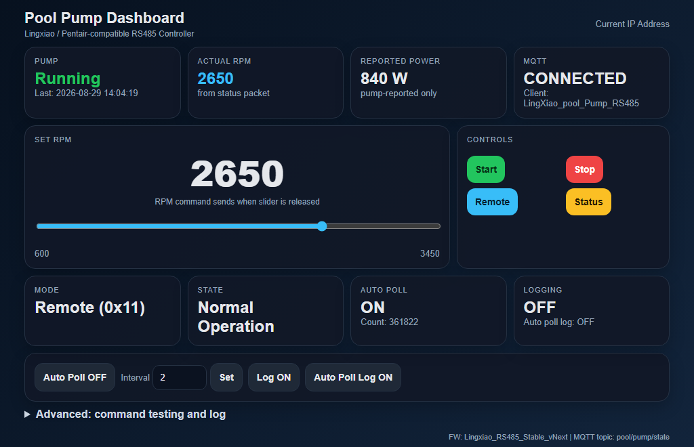
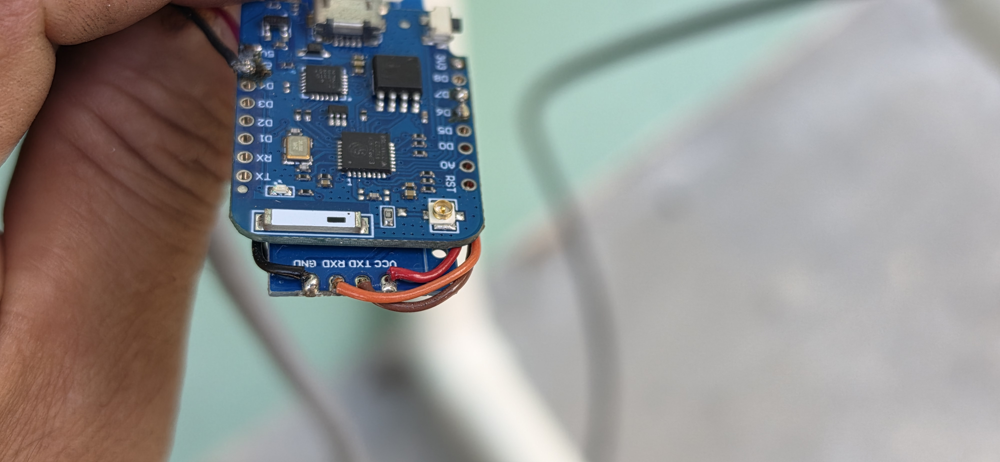
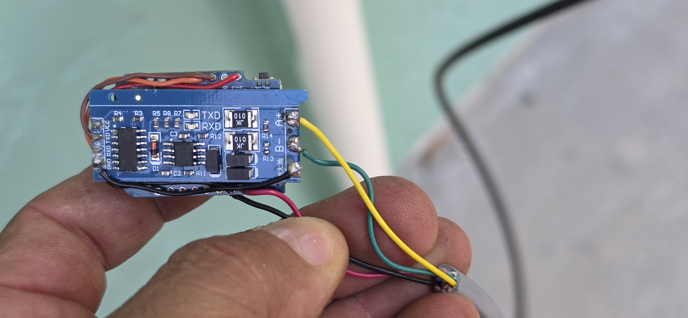
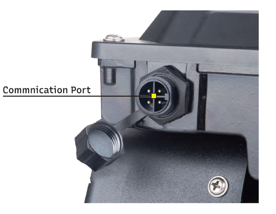
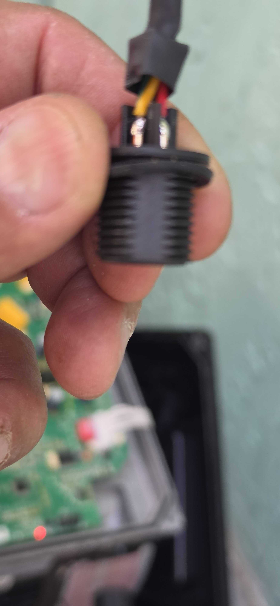
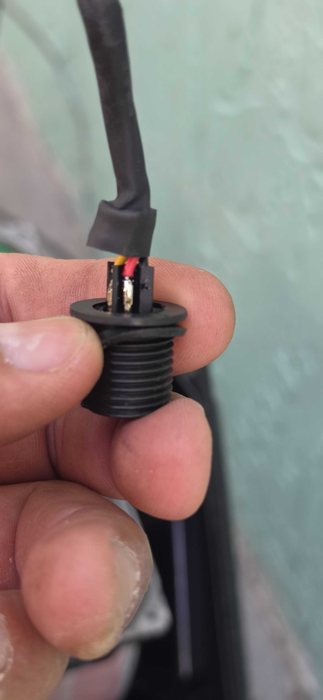

# Lingxiao SFP220-VS Pool Pump — RS485 Controller (ESP8266)

A WiFi web dashboard, Home Assistant / MQTT bridge, and RS485 sniffer for a
**Lingxiao SFP220-VS** variable-speed pool pump, running on an ESP8266.
The pump speaks a **Pentair / IntelliFlo–compatible** protocol over RS485, so
this controller builds and decodes Pentair-style automation-bus frames.

> This is a hobbyist reverse-engineering project shared **for educational and
> informational purposes only**. It is **not** affiliated with, authorized, or
> endorsed by Pentair, Lingxiao, or any other manufacturer. Use entirely at
> your own risk. See the full [Disclaimer](#disclaimer) and [Safety](#safety)
> sections below before building or using any of this.

### Project status (current)

Working and tested on a **Lingxiao SFP220-VS**. Behavior (status/mode byte
values, timing) can vary between units and firmware revisions, so treat the
decoded values here as a reference and verify against your own pump's traffic
using the built-in log.

> Tip: if commands seem ignored, keep the controller connected and polling
> (Auto Poll on) and confirm the pump reports **Mode = Remote (0x11)** in the
> log — the status poll is what establishes/maintains remote control.

---

## ⚠️ Important prerequisite — the pump must be Stopped and in Manual mode

**Nothing this controller sends will take effect unless the pump is first
stopped and set to Manual mode on the pump's own control panel.**

- Put the pump in **Manual** mode and **stop** it from the keypad first.
- Only then will the RS485 Start / Stop / Set-Speed / Remote-Enable commands be
  honored by the drive.
- If the pump is running one of its own onboard schedules / auto programs, it
  ignores external commands until you return it to Manual and stop it.

This matches how a Pentair automation controller takes over a pump: it must
enable remote control before the pump obeys the bus. Plan your testing with the
pump stopped and in Manual mode.

### What actually puts the pump in remote mode (the status request)

On this pump, **the status request (`CMD 0x07`) is what establishes and
maintains remote control** — receiving polls is the "a controller is present"
signal, and the pump enters remote (**ECON**) mode from the polling itself.

The separate **Remote Enable** command (`0x04 0xFF`) **did not appear to be
required** in testing — the status polling alone was enough to take/keep remote
control. It is left in the firmware as an option, but on this pump it seems
redundant. (Observed behavior; may differ on other units/firmware.)

### Keep-alive: the pump times out (~2 min) without polling

Because polling is the handshake, the pump expects to keep hearing status
requests. **If it does not receive a status request for roughly 2 minutes, it
times out and reverts to Manual (local) mode**, dropping remote control.

This is exactly what the **Auto Poll** feature is for: it periodically sends a
status request (`CMD 0x07`) to keep the pump in remote mode and to refresh the
live readings. Set the **Auto Poll interval** comfortably under the ~2-minute
timeout (a few seconds to tens of seconds is typical; the default is a few
seconds). If you turn Auto Poll off and send nothing for ~2 minutes, expect the
pump to fall back to Manual mode and ignore commands until polling resumes.

---



## Features

- **Live web dashboard** (dark theme): running state, actual RPM, reported
  power (watts), pump Mode and State, MQTT status, auto-poll counter.
- **RPM slider** — sets pump speed (sends the speed command on release).
- **Quick controls** — Start, Stop, Status request, and Remote Enable (note:
  the status request itself is what actually takes/keeps remote control — see
  below).
- **Auto status polling** with adjustable interval.
- **Home Assistant MQTT discovery** — pump RPM, power, running binary sensor,
  Start/Stop/Status/Remote buttons, and an RPM setpoint number entity appear
  automatically.
- **Advanced panel** — send any built-in verified command, send a custom raw
  hex packet, and view / export a decoded RX/TX log.
- **OTA updates** over WiFi.
- **First-boot friendly** — credentials live in `secrets.h`.

---

## How this was built (reverse-engineering workflow)

This pump ships with no public protocol docs, so the dashboard doubles as a
**protocol analysis tool**. The whole command set here was worked out on the
bench using three features that are still in the sketch:

- **Live RX/TX log (Advanced panel).** Every frame sent and received is shown
  as raw hex *and* decoded (header, dest/src, command, payload, checksum OK/BAD,
  and a human-readable interpretation). Watching this log while the pump ran —
  and while a real automation controller talked to it — is how the frame format,
  addresses (pump `0x60`, controller `0x10`), and the status-packet byte layout
  were mapped. You can **Export Log** to save a capture for later analysis.
- **Command testing box.** The Advanced panel has a dropdown of known-good
  commands *and* a **custom raw-hex** field. This let us try candidate packets
  one at a time and immediately see, in the log, whether the pump ACKed or
  responded — that's how commands were promoted from "experimental" to
  "verified." (Checksums are computed for you when building packets.)
- **Auto Poll + status decoding.** Continuously polling status and decoding the
  15-byte response is what revealed the run/mode/state bytes, watts, RPM, and
  the clock fields — and, by watching which byte changed under a given
  condition, which byte means what.

> Tip for further mapping: the surest way to decode an unknown field is to
> change one thing on the pump and watch exactly which status byte moves in the
> log.

### OTA — no more unplugging to reflash

The firmware supports **Arduino OTA (over-the-air) updates**. Once the board is
on your WiFi, you can upload new firmware over the network instead of carrying a
USB cable to the pump every time. This was essential during reverse-engineering:
the controller could stay wired to the pump out at the equipment pad while new
builds were pushed from the workbench, so each "try a command / tweak the
decoder / reflash" cycle took seconds and no physical access. In the Arduino IDE
the device appears as a **network port** (by its device name) once it's running.

---

## Hardware

**Pump this project is built for and tested on:**
**Lingxiao SFP220-VS** — variable-speed, self-priming in-ground pool pump
(115 / 208–230 V, ENERGY STAR certified). It exposes a **Pentair / IntelliFlo–
compatible RS485** automation bus at **9600 baud, 8N1**. It is *compatible with*
the Pentair protocol but runs Lingxiao's own firmware, so some status/mode enum
values differ from genuine Pentair pumps (documented below).

| Part | Used here | Notes |
|------|-----------|-------|
| Pump | **Lingxiao SFP220-VS** | Pentair-compatible RS485, 9600 8N1 |
| Microcontroller | **Wemos D1 Mini (ESP8266)** — the unit shown is the **Pro** variant with a u.FL external-antenna connector | Any ESP8266 board works; the external antenna helps range at the equipment pad |
| RS485 adapter | **MAX485 auto-direction (automatic flow-control) TTL↔RS485 module** (uses a 74HC04 for direction, **no DE/RE pin**) | TTL side: GND/RXD/TXD/VCC. RS485 side: **A+ / B-**. Runs at 3.3V from the Wemos |

> Because the module is **auto-direction**, the sketch uses plain SoftwareSerial
> with no direction GPIO. If your module instead has DE/RE pins, tie them
> enabled or drive them from a GPIO.




### Wiring

RS485 adapter ↔ ESP8266 (SoftwareSerial, 9600 8N1):

| Wemos D1 Mini | RS485 module (TTL side) |
|---------------|-------------------------|
| **D6** (RX) | RXD |
| **D7** (TX) | TXD |
| **3V3** | VCC |
| **GND** | GND |

(Per the sketch: `SoftwareSerial rs485Serial(D6, D7)` with `RO -> D6`,
`DI -> D7`. So D6 -> module RXD and D7 -> module TXD.)

The module's RS485 side has **A+** and **B-** terminals that go to the pump
communication cable.

The Pentair automation bus is **9600 baud, 8N1**.

### Pump communication port (Lingxiao RS485 signal cable)

The pump's watertight **Communication Port** is an **M16 4-pin waterproof
connector (male on the pump)** — so you need a **female M16 4-pin** mating
cable/connector. Confirmed pinout:

| M16 pin | Signal | Cable wire | Connect to RS485 module |
|---------|--------|------------|-------------------------|
| **1** | RS485 A | Yellow | A |
| **2** | RS485 B | Green  | B |
| **3** | GND | Black  | GND |
| **4** | **+5V (from pump)** | Red | (optional: power the ESP) |

Wire colors follow the conventional labeling: **Red = 5V, Black = GND,
Yellow = A, Green = B.**

The port is on the side of the drive housing, labeled **"Communication Port"**
(M16 male, 4 pins around a center key).



The mating cable connector and its pins (Yellow = A, Green = B, Red = 5V,
Black = GND):




**Self-powered, no extra wiring, and can be potted:** because pin 4 supplies
5V from the pump, the whole controller (Wemos D1 + RS485 module) runs entirely
off this single M16 cable — **no separate power connection or USB is needed** in
normal operation. Once wired and tested, the electronics can be **sealed in
epoxy / potting compound** for a compact, weatherproof module that just plugs
into the pump's communication port.

Notes on colors and power:
- Colors match convention: **Yellow = A, Green = B, Red = 5V, Black = GND.**
  Still verify with a multimeter before connecting (colors can vary by batch).
- **Pin 4 supplies 5V from the pump — this is where power is taken for the
  Wemos D1.** Feed pin 4 into the Wemos D1 **`5V`** pin (the USB/VBUS rail, NOT
  `3V3`); the board's onboard regulator produces 3.3V for the ESP. Then the
  single M16 cable carries both RS485 data and power. Confirm ~5V under load
  and adequate current with a meter before relying on it; keep grounds common.
- The pump-side connector is **male**; the mating cable end is **female**, so
  the two faces are mirror images. Always reference the pin the wire physically
  lands on (confirm with a continuity check).

> **Measure before you connect.** Before wiring anything to the ESP8266, use a
> multimeter to **verify the voltage on pin 4 (expect ~5V) and confirm the
> polarity/pinout** of every pin against the table above. Connector faces are
> mirrored and cable colors vary between batches, so do not assume — measure.
> Applying the wrong voltage to the wrong pin, or reversed polarity, can
> destroy the ESP8266, the RS485 module, or the pump's control board.

Notes:
- The pump is compatible with Pentair PL4/PLS4, Jandy, and Hayward automation
  over this port. For Hayward, the manual says to change the baud rate on the
  pump (press **Tab + 2**) so the pump speaks Hayward's language.
- On successful link the pump display shows **ECON** and the communication
  indicator lights — at that point the pump has handed control to the external
  system.
- If you get no communication, **swap Yellow/Green (A/B)** — A/B polarity is the
  usual culprit.
- Tighten the watertight nut on the port to keep moisture out.

### Connection diagram

```
        Wemos D1 Mini (ESP8266)             MAX485 auto-direction module              Lingxiao SFP220-VS
        +---------------------+             +--------------------------+              +---------------------+
        |                     |             |  TTL side     RS485 side |              |  M16 4-pin port      |
        |                 3V3 +------------>+ VCC                      |              |  (male, on pump)    |
        |                 GND +------------>+ GND                  A+ <+---YELLOW---->+ Pin 1: RS485 A      |
        |    D6 (RX)      ----+-------------+ RXD                  B- <+---GREEN----->+ Pin 2: RS485 B      |
        |    D7 (TX)      ----+-------------+ TXD                     |              |                     |
        |                     |             |                        |              +---------------------+
        |    5V  <------------+---------------------RED----------------------------->+ Pin 4: +5V (pump)   |
        |    GND <------------+---------------------BLACK--------------------------->+ Pin 3: GND          |
        +---------------------+             +--------------------------+              (9600 baud, 8N1)

  Boards: Wemos D1 Mini (ESP8266, external-antenna "Pro" variant shown) +
          MAX485 auto-direction TTL<->RS485 module (labels: GND RXD TXD VCC / A+ B-).

  Module TTL side -> Wemos:  VCC=3V3, GND=GND,  D6 -> module RXD,  D7 -> module TXD.
      (Per the sketch: SoftwareSerial(D6, D7), RO->D6, DI->D7.)
  Module RS485 side -> pump:  A+ = Yellow (Pin 1 / A),  B- = Green (Pin 2 / B).
  Power/ground come straight from the pump's M16 port:  Red = +5V (Pin 4),  Black = GND (Pin 3).

  Pump connector: M16 4-pin waterproof (male on pump).
  Pinout:  Pin 1 = A (Yellow),  Pin 2 = B (Green),  Pin 3 = GND (Black),  Pin 4 = +5V (Red).
  Notes:
   - Auto-direction module: no DE/RE wiring needed.
   - Common ground across Wemos, RS485 module, and pump (Pin 3 / Black).
   - The whole controller is powered from the pump's +5V (Pin 4) - no USB needed in normal use.
   - Keep the A/B pair short/twisted. If no comms, swap A/B (Yellow/Green).
   - On a good link the pump shows ECON and the comm indicator lights.
```

---

## Software setup

1. Install the **ESP8266 Arduino core** (Boards Manager URL:
   `https://arduino.esp8266.com/stable/package_esp8266com_index.json`).
2. Install libraries: **PubSubClient**, **EspSoftwareSerial** (ESP8266WiFi,
   ESP8266WebServer, ArduinoOTA come with the core).
3. Copy `LingxiaoPumpRS485/secrets.h.example` to
   `LingxiaoPumpRS485/secrets.h` and fill in your WiFi + MQTT details.
   `secrets.h` is gitignored so your credentials stay private.
4. Open `LingxiaoPumpRS485/LingxiaoPumpRS485.ino`, select your board, and
   upload.
5. Find the device IP (serial monitor at 115200, or your router). Open it in a
   browser.

---

## The Pentair / IntelliFlo RS485 protocol

The pump uses the Pentair automation-bus frame format. This has been
reverse-engineered by the community over many years; this project relies on
that public work (see **Sources**). Frame layout:

```
FF 00 FF A5 | PROTO | DEST | SRC | CMD | LEN | DATA[LEN] | CHK_HI CHK_LO
```

- **Header:** `FF 00 FF A5` (the leading `FF`s are a preamble; `A5` starts the
  real frame).
- **Protocol:** `0x00` for IntelliFlo pump messages.
- **Addresses:** pump = `0x60` (96), controller = `0x10` (16).
- **Checksum:** 16-bit sum of all bytes starting at `A5` through the last data
  byte, high byte first.

### Pump status response — Command `0x07`, 15-byte payload

Requesting status (`CMD 0x07`, no data) makes the pump reply with a 15-byte
status payload. Field mapping (community "longstanding interpretation",
confirmed/corrected against live systems — see Sources):

| Payload byte | Field | Notes |
|--------------|-------|-------|
| [0] | Pump Running | `0x0A` = started, `0x04` = stopped |
| [1] | Pump Mode | `0x00` Filter, `0x01` Manual, `0x02` Backwash, `0x06` Feature 1, `0x09`–`0x0C` Ext Program 1–4 |
| [2] | Pump State | `0x02` Running, `0x01` Priming, `0x04` System Priming, `0x00` Fault |
| [3]–[4] | Power (watts) | `watts = [3]*256 + [4]` |
| [5]–[6] | Speed (RPM) | `rpm = [5]*256 + [6]` |
| [7] | Flow (GPM) | VF / VS-F pumps only; 0 on plain VS |
| [8] | Filter percent used | 100 during a Filter Error |
| [9] | Unknown | 0 in captures |
| [10] | Pump Error | `0x00` OK, `0x02` Filter Error; other codes not fully mapped |
| [11]–[12] | Time remaining | hh : mm |
| [13] | Clock hours | 0–23 |
| [14] | Clock minutes | 0–59 |

### Note: the Lingxiao pump differs from standard Pentair values

This is a Pentair-**compatible** pump, not a real Pentair, so some enum values
differ from the tables above. Values observed on this SFP220-VS:

| Byte | Observed on SFP220-VS |
|------|--------------------------|
| Mode [1] | `0x00` = Local, `0x11` = Remote |
| State [2] | `0x01` = Normal Operation, `0x03` = Priming, `0x07` = Alarm, `0xFF` = Stopped |

The firmware decodes both the observed Lingxiao values **and** the standard
Pentair values (labeled), and shows raw hex for anything unknown. A built-in
passive discovery view flags never-seen packet types and logs which status byte
changed — useful for mapping the remaining fields (e.g. the error byte) by
provoking a condition and watching what changes.

### Verified controller → pump commands

| Purpose | CMD | Data |
|---------|-----|------|
| Status request | `0x07` | (none) |
| Start / Run | `0x06` | `0x0A` |
| Stop | `0x06` | `0x04` |
| Remote enable | `0x04` | `0xFF` |
| Set speed | `0x01` | `02 C4 <rpm_hi> <rpm_lo>` |

There is **no documented "clear fault" command** in the reverse-engineered
protocol — a faulted pump is cleared by removing the cause or power-cycling
(see Error codes).

---

## Lingxiao SFP220-VS error / fault codes

From the Lingxiao variable-speed pump instruction manual (Troubleshooting
section). **E002 auto-recovers; all other codes stop the controller and require
a power cycle to restart.**

| Code | Fault | Common cause |
|------|-------|--------------|
| E001 | IPM (power module) failure | Power electronics / interference / ground |
| E002 | Output current over limit | Sudden load change (auto-recovers) |
| E006 | Input voltage too high | Abnormal supply / load disconnect |
| E009 | Input voltage too low | Low supply voltage |
| E011 | Motor overload | Low voltage / stall / load change |
| E013 | Output phase loss | U/V/W phase loss or imbalance |
| E014 | Controller overheat | High ambient / control board fault |
| E018 | Faulty current-sampling circuit | Current-detect element fault |
| E021 | Display board EEPROM failure | Bad display↔main-board link |
| E040 | Static blockage | Motor mechanical lock-up |
| E048 | PFC over-current | Low voltage / PFC circuit fault |
| E095 | Communication fault | Bad display↔main-board connection |
| E030 | Dry Run Alarm | Running dry / mis-report on stop |
| LOF  | Dry Run Alarm (low flow) | Flow below 18 GPM / 70 LPM |

> How the pump detects dry-run / prime: variable-speed drives infer it from the
> motor's electrical load (water present ⇒ expected power draw at a given RPM;
> spinning air ⇒ abnormally low power). The priming routine runs at a high
> fixed RPM for a set time on start; if the load never indicates water, it
> raises a dry-run/priming alarm.

---

## MQTT topics

- **State (published):** `pool/pump/state` — JSON with `running`, `rpm`,
  `setRpm`, `reported_power`, `mode`, `state`, `last`, `auto_poll`.
- **Commands (subscribed):** `pool/pump/cmd/start`, `/stop`, `/status`,
  `/remote`, `/rpm`.
> **Note on reported power:** the pump's reported watts is **not accurate** — in
> my experience it usually reads **higher** than actual. For real power I use a
> separate whole-home power monitor. Treat the pump's value as a rough estimate.

### Home Assistant auto-discovery

The firmware publishes MQTT **discovery** configs under `homeassistant/...`, so
Home Assistant creates the pump entities **automatically — no YAML needed**.
With the HA MQTT integration set up, you get RPM, power, a running sensor,
Start/Stop/Status/Remote buttons, and an RPM setpoint, all on their own.

---

## Safety

- **Pump must be Stopped and in Manual mode** for commands to take effect (see
  top of this document).
- This project drives real pool equipment. Test with the pump stopped, and be
  cautious sending experimental / custom packets.
- No dedicated "clear fault" command exists; clear faults by fixing the cause
  or power-cycling the pump.
- **Measure with a multimeter to verify voltage and polarity** on the M16
  connector before wiring anything — confirm pin 4 is ~5V and that each pin
  matches the pinout. Wrong voltage or reversed polarity can destroy hardware.
- Mind electrical safety and GFCI requirements per the pump manual.
- **Educational use only** — see the [Disclaimer](#disclaimer). You assume all
  risk and responsibility.

---

## Sources

Reverse-engineering and protocol interpretation build on prior community work.
Content in this document was paraphrased/summarized from these sources for
licensing compliance:

- **Pentair Automation Bus (RS-485) Protocol** — community protocol document.
  <https://docs.google.com/document/d/1M0KMfXfvbszKeqzu6MUF_7yM6KDHk8cZ5nrH1_OUcAc/mobilebasic>
- **nodejs-poolController** — tagyoureit et al. (status byte mapping beyond
  byte [2]). <https://github.com/tagyoureit/nodejs-poolController>
- **Arduino.Pentair** — Zuntara (RS-485 pin location, early decoding).
  <https://github.com/Zuntara/Arduino.Pentair>
- **Brute Forcing Pentair RS-485** — wolfteck.
  <http://wolfteck.com/2019/02/04/brute_forcing_pentair_rs-485/>
- **openHAB Pentair binding** — bus basics (9600 8N1).
  <https://www.openhab.org/addons/bindings/pentair/>
- **Lingxiao variable-speed pump instruction manual** — Troubleshooting /
  error-code table (E001–E095, E030, LOF) and priming behavior.

This list may be incomplete. Over the course of the project I also drew on
various forum posts, datasheets, videos, and other community resources that I
may not have kept track of or have since forgotten. **Credit is due to all of
that prior community work**, even where it isn't individually cited here — if
you recognize your work and want attribution (or removal), please open an issue.

Trademarks (Pentair, IntelliFlo, Lingxiao, Home Assistant, Tasmota) belong to
their respective owners.

---

## Disclaimer

**This project is provided for educational and informational purposes only.**

- It documents personal, hobbyist reverse-engineering and experimentation with
  an RS485 interface on a pool pump. It is **not** official documentation and is
  **not** affiliated with, authorized, manufactured, or endorsed by Pentair,
  Lingxiao, Jandy, Hayward, or any other company. All trademarks belong to their
  respective owners.
- The information (protocol decoding, pinouts, wire colors, commands, and error
  codes) is **provided "as is," without any warranty** of any kind, express or
  implied, including accuracy, completeness, merchantability, or fitness for a
  particular purpose. Details vary between pump models, firmware, and production
  batches and **may be wrong for your unit** — always verify independently
  (e.g. with a multimeter and continuity checks).
- Working with mains-powered pool equipment, RS485 wiring, and custom firmware
  carries real risks including **electric shock, equipment damage, voiding your
  warranty, fire, water damage, and personal injury**. Pool pumps are connected
  to electrical and water systems governed by codes and regulations in your
  area; consult a **licensed electrician / qualified professional** and follow
  the manufacturer's manual and all applicable codes.
- **Any damage to your pump (or any other equipment) from attempting any of
  this is entirely at your own risk.** Interfacing with the pump's
  communication port, sending commands, or mis-wiring can damage or destroy the
  pump's control board and is not covered by any warranty.
- **You assume all responsibility and risk.** By using any part of this project
  you agree that the author(s) and contributors are **not liable** for any
  damage, loss, injury, or other consequence arising from its use, misuse, or
  inability to use it. If you are not comfortable assuming that responsibility,
  do not use this project.

## License

MIT — see [LICENSE](LICENSE). Note the MIT license's "AS IS", no-warranty, and
no-liability terms apply to everything in this repository, including the
documentation.
